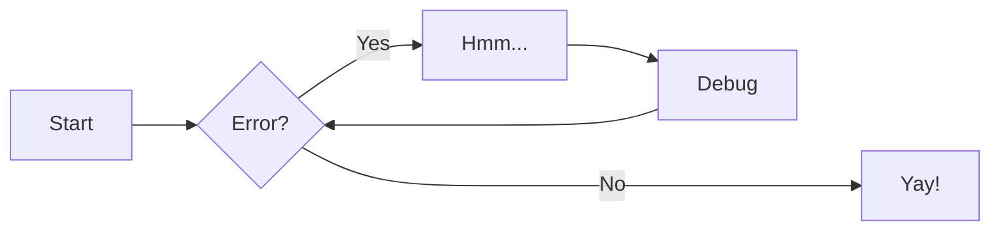

# Diagram as Code

Para utilizar os diagramas em seu ambiente local será necessário instalar alguns pacotes python e rodar o mkdocs.

## Install

```bash
pip3 install mkdocs
pip3 install mkdocs-techdocs-core
```

## PlantUML

*Ótimo para diagramas de classe, sequência, caso de uso, entre outros...*

*[ref.: PlantUML examples](https://plantuml.com/)*

### Install

```bash
curl -o plantuml.jar -L http://sourceforge.net/projects/plantuml/files/plantuml.1.2020.16.jar/download 
echo "c789ace48347c43073232b1458badc5810c01fe8  plantuml.jar" | sha1sum -c - 
mv plantuml.jar /opt/plantuml.jar
echo '#!/bin/sh\n\njava -jar /opt/plantuml.jar ${​​​​​@}​​​​​' > /usr/local/bin/plantuml
chmod +x /usr/local/bin/plantuml
plantuml -version
```

### Diagrams

#### Sequência

---

#### Caso de uso

---

#### Classe

---

#### Component

---

## Diagrams

*Indicado para desenhos a nível de solução e infra.*

*[ref.: Diagrams examples](https://diagrams.mingrammer.com/docs/getting-started/examples)*

### Eventos


---

### Kubernetes


---

## Graphviz

*[ref.: GraphViz Galery ](https://graphviz.org/gallery/)*

### Data Structures

{% dot attack_plan.svg
   digraph g {
        graph [
        rankdir = "LR"
        ];
        node [
        fontsize = "16"
        shape = "ellipse"
        ];
        edge [
        ];
        "node0" [
        label = "<f0> 0x10ba8| <f1>"
        shape = "record"
        ];
        "node1" [
        label = "<f0> 0xf7fc4380| <f1> | <f2> |-1"
        shape = "record"
        ];
        "node2" [
        label = "<f0> 0xf7fc44b8| | |2"
        shape = "record"
        ];
        "node3" [
        label = "<f0> 3.43322790286038071e-06|44.79998779296875|0"
        shape = "record"
        ];
        "node4" [
        label = "<f0> 0xf7fc4380| <f1> | <f2> |2"
        shape = "record"
        ];
        "node5" [
        label = "<f0> (nil)| | |-1"
        shape = "record"
        ];
        "node6" [
        label = "<f0> 0xf7fc4380| <f1> | <f2> |1"
        shape = "record"
        ];
        "node7" [
        label = "<f0> 0xf7fc4380| <f1> | <f2> |2"
        shape = "record"
        ];
        "node8" [
        label = "<f0> (nil)| | |-1"
        shape = "record"
        ];
        "node9" [
        label = "<f0> (nil)| | |-1"
        shape = "record"
        ];
        "node10" [
        label = "<f0> (nil)| <f1> | <f2> |-1"
        shape = "record"
        ];
        "node11" [
        label = "<f0> (nil)| <f1> | <f2> |-1"
        shape = "record"
        ];
        "node12" [
        label = "<f0> 0xf7fc43e0| | |1"
        shape = "record"
        ];
        "node0":f0 -> "node1":f0 [
        id = 0
        ];
        "node0":f1 -> "node2":f0 [
        id = 1
        ];
        "node1":f0 -> "node3":f0 [
        id = 2
        ];
        "node1":f1 -> "node4":f0 [
        id = 3
        ];
        "node1":f2 -> "node5":f0 [
        id = 4
        ];
        "node4":f0 -> "node3":f0 [
        id = 5
        ];
        "node4":f1 -> "node6":f0 [
        id = 6
        ];
        "node4":f2 -> "node10":f0 [
        id = 7
        ];
        "node6":f0 -> "node3":f0 [
        id = 8
        ];
        "node6":f1 -> "node7":f0 [
        id = 9
        ];
        "node6":f2 -> "node9":f0 [
        id = 10
        ];
        "node7":f0 -> "node3":f0 [
        id = 11
        ];
        "node7":f1 -> "node1":f0 [
        id = 12
        ];
        "node7":f2 -> "node8":f0 [
        id = 13
        ];
        "node10":f1 -> "node11":f0 [
        id = 14
        ];
        "node10":f2 -> "node12":f0 [
        id = 15
        ];
        "node11":f2 -> "node1":f0 [
        id = 16
        ];
    }
%} 

---

### Family Tree

{% dot family.svg

graph G {
    I5 [shape=ellipse,color=red,style=bold,label="Caroline Bouvier Kennedy\nb. 27.11.1957 New York",image="images/165px-Caroline_Kennedy.jpg",labelloc=b];
    I1 [shape=box,color=blue,style=bold,label="John Fitzgerald Kennedy\nb. 29.5.1917 Brookline\nd. 22.11.1963 Dallas",image="images/kennedyface.jpg",labelloc=b];
    I6 [shape=box,color=blue,style=bold,label="John Fitzgerald Kennedy\nb. 25.11.1960 Washington\nd. 16.7.1999 over the Atlantic Ocean, near Aquinnah, MA, USA",image="images/180px-JFKJr2.jpg",labelloc=b];
    I7 [shape=box,color=blue,style=bold,label="Patrick Bouvier Kennedy\nb. 7.8.1963\nd. 9.8.1963"];
    I2 [shape=ellipse,color=red,style=bold,label="Jaqueline Lee Bouvier\nb. 28.7.1929 Southampton\nd. 19.5.1994 New York City",image="images/jacqueline-kennedy-onassis.jpg",labelloc=b];
    I8 [shape=box,color=blue,style=bold,label="Joseph Patrick Kennedy\nb. 6.9.1888 East Boston\nd. 16.11.1969 Hyannis Port",image="images/1025901671.jpg",labelloc=b];
    I10 [shape=box,color=blue,style=bold,label="Joseph Patrick Kennedy Jr\nb. 1915\nd. 1944"];
    I11 [shape=ellipse,color=red,style=bold,label="Rosemary Kennedy\nb. 13.9.1918\nd. 7.1.2005",image="images/rosemary.jpg",labelloc=b];
    I12 [shape=ellipse,color=red,style=bold,label="Kathleen Kennedy\nb. 1920\nd. 1948"];
    I13 [shape=ellipse,color=red,style=bold,label="Eunice Mary Kennedy\nb. 10.7.1921 Brookline"];
    I9 [shape=ellipse,color=red,style=bold,label="Rose Elizabeth Fitzgerald\nb. 22.7.1890 Boston\nd. 22.1.1995 Hyannis Port",image="images/Rose_kennedy.JPG",labelloc=b];
    I15 [shape=box,color=blue,style=bold,label="Aristotle Onassis"];
    I3 [shape=box,color=blue,style=bold,label="John Vernou Bouvier III\nb. 1891\nd. 1957",image="images/BE037819.jpg",labelloc=b];
    I4 [shape=ellipse,color=red,style=bold,label="Janet Norton Lee\nb. 2.10.1877\nd. 3.1.1968",image="images/n48862003257_1275276_1366.jpg",labelloc=b];
    I1 -- I5  [style=bold,color=blue]; 
    I1 -- I6  [style=bold,color=orange]; 
    I2 -- I6  [style=bold,color=orange]; 
    I1 -- I7  [style=bold,color=orange]; 
    I2 -- I7  [style=bold,color=orange]; 
    I1 -- I2  [style=bold,color=violet]; 
    I8 -- I1  [style=bold,color=blue]; 
    I8 -- I10  [style=bold,color=orange]; 
    I9 -- I10  [style=bold,color=orange]; 
    I8 -- I11  [style=bold,color=orange]; 
    I9 -- I11  [style=bold,color=orange]; 
    I8 -- I12  [style=bold,color=orange]; 
    I9 -- I12  [style=bold,color=orange]; 
    I8 -- I13  [style=bold,color=orange]; 
    I9 -- I13  [style=bold,color=orange]; 
    I8 -- I9  [style=bold,color=violet]; 
    I9 -- I1  [style=bold,color=red]; 
    I2 -- I5  [style=bold,color=red]; 
    I2 -- I15  [style=bold,color=violet]; 
    I3 -- I2  [style=bold,color=blue]; 
    I3 -- I4  [style=bold,color=violet]; 
    I4 -- I2  [style=bold,color=red]; 
    }

%}


---

### Linux Kernel Diagram

{% dot kernel.svg
    digraph matrix {
        graph [newrank=true,
            nodesep=0.1,
            overlap=true,
            ranksep=0.1,
            splines=false,
            nodesep=0.3,
            ranksep=0.2,
            //bgcolor="transparent",
        ];
        node [fixedsize=false,
            fontname="Ubuntu"
            fontsize=24,
            height=1,
            shape=box,
            style="filled,setlinewidth(6)",
            width=2.2
        ];
        edge [arrowhead=none,
            arrowsize=0.5,
            style=invis,
            labelfontname="Ubuntu",
            weight=10
        ];
        {
            node [color="#e27dd6ff"];
            system_		 [color="#e27dd6ff",
                fixedsize=true,
                height=0,
                shape="",
                style=invis,
                width=0];
            system		 [color="#e27dd6ff",
                fillcolor=white,
                fixedsize=true,
                height=0.6,
                row=func,
                width=2];
            system -> system_		 [arrowhead="",
                color="#e27dd6ff",
                row=func,
                style="filled,setlinewidth(6)"];
            SCI		 [color="#e27dd6ff",
                fillcolor="#d9e7ee",
                fixedsize=true,
                label="System calls",
                row=usr,
                shape=ellipse];
            sysfs		 [color="#e27dd6ff",
                fillcolor="#b2d3e4",
                label="proc, sysfs,\nfile systems"];
            SCI -> sysfs		 [color="#e27dd6ff",
                style="filled,setlinewidth(6)"];
            DM		 [color="#e27dd6ff",
                fillcolor="#91b5c9",
                fixedsize=true,
                fontsize=20,
                height=0.8,
                label="Device\nModel",
                shape=octagon,
                width=2];
            sysfs -> DM		 [color="#e27dd6ff",
                style="filled,setlinewidth(6)"];
            log_sys		 [color="#e27dd6ff",
                fillcolor="#6a9ab1",
                fontsize=20,
                label="system run,\nmodules,\ngeneric\nHW access "];
            DM -> log_sys		 [color="#e27dd6ff",
                style="filled,setlinewidth(6)"];
            bus_drv		 [color="#e27dd6ff",
                fillcolor="#71809b",
                label="bus drivers"];
            log_sys -> bus_drv		 [color="#e27dd6ff",
                style="filled,setlinewidth(6)"];
            H2		 [color="#e27dd6ff",
                fillcolor="#777777",
                fontcolor=white,
                fontsize=20,
                label="busess:\nPCI, USB ...",
                row=chip];
            bus_drv -> H2		 [color="#e27dd6ff",
                style="filled,setlinewidth(6)"];
        }
        {
            node [color="#61c2c5"];
            edge [color="#61c2c5"];
            networking_		 [color="#61c2c5",
                fixedsize=true,
                height=0,
                shape="",
                style=invis,
                width=0];
            networking		 [color="#61c2c5",
                fillcolor=white,
                fixedsize=true,
                height=0.6,
                row=func,
                width=2];
            networking -> networking_		 [arrowhead="",
                color="#61c2c5",
                row=func,
                style="filled,setlinewidth(6)"];
            sock		 [color="#61c2c5",
                fillcolor="#d9e7ee",
                fixedsize=true,
                label=Sockets,
                row=usr,
                shape=ellipse];
            prot_fam		 [color="#61c2c5",
                fillcolor="#b2d3e4",
                label="protocol\nfamilies"];
            sock -> prot_fam		 [color="#61c2c5",
                style="filled,setlinewidth(6)"];
            log_prot		 [color="#61c2c5",
                fillcolor="#6a9ab1",
                label="protocols:\nTCP, UDP, IP"];
            prot_fam -> log_prot		 [color="#61c2c5",
                style="filled,setlinewidth(6)"];
            netif		 [color="#61c2c5",
                fillcolor="#71809b",
                fontsize=20,
                label="network\ninterfaces\nand drivers"];
            log_prot -> netif		 [color="#61c2c5",
                style="filled,setlinewidth(6)"];
            net_hw		 [color="#61c2c5",
                fillcolor="#777777",
                fontcolor=white,
                fontsize=20,
                label="network:\nEthernet, WiFi ...",
                row=chip];
            netif -> net_hw		 [color="#61c2c5",
                style="filled,setlinewidth(6)"];
            NFS		 [color="#8383cc",
                fillcolor="#91b5c9",
                fixedsize=true,
                height=0.8,
                label=NFS,
                shape=octagon,
                width=1.2];
            NFS -> log_prot		 [color="#61c2c5",
                style="filled,setlinewidth(6)",
                weight=0];
        }
        {
            node [color="#8383cc"];
            edge [color="#8383cc"];
            NFS;
            storage_		 [color="#8383cc",
                fixedsize=true,
                height=0,
                shape="",
                style=invis,
                width=0];
            storage		 [color="#8383cc",
                fillcolor=white,
                fixedsize=true,
                height=0.6,
                row=func,
                width=2];
            storage -> storage_		 [arrowhead="",
                color="#8383cc",
                row=func,
                style="filled,setlinewidth(6)"];
            FS		 [color="#8383cc",
                fillcolor="#d9e7ee",
                fixedsize=true,
                label="files and\ndirectories",
                row=usr,
                shape=ellipse];
            VFS		 [color="#8383cc",
                fillcolor="#b2d3e4",
                label="Virtual\nFile System"];
            FS -> VFS		 [color="#8383cc",
                style="filled,setlinewidth(6)"];
            VFS -> NFS		 [color="#8383cc",
                style="filled,setlinewidth(6)",
                weight=0];
            logFS		 [color="#8383cc",
                fillcolor="#6a9ab1",
                fontsize=20,
                label="logical\nfilesystems:\next3, xfs ..."];
            VFS -> logFS		 [color="#8383cc",
                style="filled,setlinewidth(6)"];
            PC		 [color="#51bf5b",
                fillcolor="#91b5c9",
                fixedsize=true,
                fontsize=20,
                height=0.8,
                label="page\ncache",
                shape=octagon,
                width=1.2];
            VFS -> PC		 [color="#8383cc",
                style="filled,setlinewidth(6)",
                weight=0];
            mmap		 [color="#51bf5b",
                fillcolor="#91b5c9",
                fixedsize=true,
                fontsize=20,
                height=0.8,
                label="memory\nmapping",
                shape=octagon,
                width=2];
            VFS -> mmap		 [color="#8383cc",
                style="filled,setlinewidth(6)",
                weight=0];
            block		 [color="#8383cc",
                fillcolor="#71809b",
                fontsize=20,
                label="Block\ndevices\nand drivers"];
            logFS -> block		 [color="#8383cc",
                style="filled,setlinewidth(6)"];
            PA		 [color="#51bf5b",
                fillcolor="#71809b",
                label="Page\nAllocator"];
            PC -> PA		 [color="#51bf5b",
                style="filled,setlinewidth(6)",
                weight=0];
            H4		 [color="#8383cc",
                fillcolor="#777777",
                fontcolor=white,
                fontsize=20,
                label="storage devices:\nSCSI, NVMe ...",
                row=chip];
            block -> H4		 [color="#8383cc",
                style="filled,setlinewidth(6)"];
            SW		 [color="#8383cc",
                fillcolor="#91b5c9",
                fixedsize=true,
                label=Swap,
                height=0.8,
                shape=octagon,
                width=1.2];
            SW -> block		 [color="#8383cc",
                style="filled,setlinewidth(6)",
                weight=0];
        }
        {
            node [color="#c46747",
                style="filled,setlinewidth(6)"
            ];
            edge [color="#c46747"];
            processing_		 [color="#c46747",
                fixedsize=true,
                height=0,
                shape="",
                style=invis,
                width=0];
            processing		 [color="#c46747",
                fillcolor=white,
                fixedsize=true,
                height=0.6,
                row=func,
                width=2];
            processing -> processing_		 [arrowhead="",
                color="#c46747",
                row=func,
                style="filled,setlinewidth(6)"];
            proc		 [color="#c46747",
                fillcolor="#d9e7ee",
                fixedsize=true,
                label=Processes,
                row=usr,
                shape=ellipse];
            Tasks		 [color="#c46747",
                fillcolor="#b2d3e4"];
            proc -> Tasks		 [color="#c46747",
                style="filled,setlinewidth(6)"];
            sync		 [color="#c46747",
                fillcolor="#91b5c9",
                fixedsize=true,
                fontsize=20,
                fontname="Ubuntu Condensed"
                label=synchronization,
                height=0.7,
                width=2,
                shape=octagon];
            Tasks -> sync		 [color="#c46747",
                style="filled,setlinewidth(6)"];
            sched		 [color="#c46747",
                fillcolor="#6a9ab1",
                label=Scheduler];
            sync -> sched		 [color="#c46747",
                style="filled,setlinewidth(6)"];
            IRQ		 [color="#c46747",
                fillcolor="#71809b",
                fontsize=20,
                label="interrupts\ncore,\nCPU arch"];
            sched -> IRQ		 [color="#c46747",
                style="filled,setlinewidth(6)"];
            CPU		 [color="#c46747",
                fillcolor="#777777",
                fontcolor=white,
                fontsize=20,
                row=chip];
            IRQ -> CPU		 [color="#c46747",
                style="filled,setlinewidth(6)"];
        }
        {
            node [color="#cfbf57ff",
                style="filled,setlinewidth(6)"
            ];
            edge [color="#cfbf57ff",
                weight=10
            ];
            HI_		 [color="#cfbf57ff",
                fixedsize=true,
                height=0,
                shape="",
                style=invis,
                width=0];
            HI		 [color="#cfbf57ff",
                fillcolor=white,
                fixedsize=true,
                fontsize=20,
                height=0.6,
                label="human\ninterface",
                row=func,
                width=2];
            HI -> HI_		 [arrowhead="",
                color="#cfbf57ff",
                row=func,
                style="filled,setlinewidth(6)"];
            char		 [color="#cfbf57ff",
                fillcolor="#d9e7ee",
                fixedsize=true,
                label="char\ndevices",
                row=usr,
                shape=ellipse];
            input		 [color="#cfbf57ff",
                fillcolor="#b2d3e4",
                label="input\nsubsystem"];
            char -> input		 [color="#cfbf57ff",
                style="filled,setlinewidth(6)"];
            F7		 [color="#cfbf57ff",
                fillcolor="#6a9ab1",
                label="HI class\ndrivers"];
            input -> F7		 [color="#cfbf57ff",
                style="filled,setlinewidth(6)"];
            HID		 [color="#cfbf57ff",
                fillcolor="#71809b",
                fontsize=20,
                URL="https://www.kernel.org/doc/html/latest/hid/",
                label="HI\nperipherals\ndrivers"];
            F7 -> HID		 [color="#cfbf57ff",
                style="filled,setlinewidth(6)"];
            H7		 [color="#cfbf57ff",
                fillcolor="#777777",
                fontcolor=white,
                fontsize=20,
                label="display, keyboard,\nmouse, audio",
                row=chip];
            HID -> H7		 [color="#cfbf57ff",
                style="filled,setlinewidth(6)"];
        }
        {
            graph [rank=same];
            edge [style=invis,
                weight=1
            ];
            system;
            networking;
            system -> networking		 [weight=1];
            storage;
            networking -> storage		 [weight=1];
            memory		 [color="#51bf5b",
                fillcolor=white,
                fixedsize=true,
                height=0.6,
                row=func,
                width=2];
            storage -> memory		 [weight=1];
            processing;
            HI;
            processing -> HI		 [weight=1];
            memory -> processing		 [weight=1];
            functions_		 [fixedsize=true,
                height=0,
                shape="",
                style=invis,
                width=0];
            functions_ -> system		 [weight=1];
            functions		 [color=gray,
                tooltip="Columns represent main functionalities of the kernel",
                URL="http://www.makelinux.net/ldd3/chp-1-sect-2.shtml",
                fillcolor=gray,
                fixedsize=true,
                height=0.6,
                row=func,
                style=dashed,
                width=1.6];
            functions -> functions_		 [arrowhead="",
                color=gray,
                style="",
                weight=""];
        }
        {
            graph [rank=same];
            SCI;
            sock;
            FS;
            proc;
            char;
            usr_		 [fixedsize=true,
                height=0,
                shape="",
                style=invis,
                width=0.5];
            usr		 [fillcolor="#d9e7eeff",
                fixedsize=true,
                label="user space\ninterfaces",
                row=usr,
                shape=ellipse,
                style="filled,setlinewidth(0)"];
            MA		 [color="#51bf5b",
                fillcolor="#d9e7ee",
                fixedsize=true,
                label="memory\naccess",
                row=usr,
                shape=ellipse];
        }
        {
            edge [style=invis,
                weight=10
            ];
            system_;
            SCI;
            system_ -> SCI;
            networking_;
            sock;
            networking_ -> sock;
            storage_;
            FS;
            storage_ -> FS;
            processing_;
            proc;
            processing_ -> proc;
            HI_;
            char;
            HI_ -> char;
            MA;
            memory_		 [fixedsize=true,
                height=0,
                shape="",
                style=invis,
                width=0];
            memory_ -> MA;
        }
        {
            graph [rank=same];
            sysfs;
            prot_fam;
            VFS;
            Tasks;
            input;
            D0		 [fixedsize=true,
                height=0,
                shape="",
                style=invis,
                width=0];
            virt		 [fillcolor="#b2d3e4",
                label="virtual\nsubsystems",
                style="filled,setlinewidth(0)"];
            VM		 [color="#51bf5b",
                fillcolor="#b2d3e4",
                label="Virtual\nmemory"];
        }
        {
            graph [rank=same];
            DM;
            NFS;
            mmap;
            sync;
            E0		 [fixedsize=true,
                height=0,
                shape="",
                style=invis,
                width=0];
            bridges		 [fillcolor="#91b5c9",
                shape=octagon,
                style="filled,setlinewidth(0)"];
        }
        {
            graph [rank=same];
            log_sys;
            log_prot;
            logFS;
            sched;
            F7;
            F0		 [fixedsize=true,
                height=0,
                shape="",
                style=invis,
                width=0];
            logical		 [fillcolor="#6a9ab1",
                style="filled,setlinewidth(0)"];
            log_mem		 [color="#51bf5b",
                fillcolor="#6a9ab1",
                label="logical\nmemory"];
        }
        {
            graph [rank=same];
            bus_drv;
            netif;
            block;
            PA;
            IRQ;
            HID;
            G0		 [fixedsize=true,
                height=0,
                shape="",
                style=invis,
                width=0];
            HWI		 [fillcolor="#71809b",
                label="hardware\ninterfaces",
                style="filled,setlinewidth(0)"];
        }
        {
            graph [rank=same];
            H2;
            net_hw;
            H4;
            CPU;
            H7;
            H0		 [fixedsize=true,
                height=0,
                shape="",
                style=invis,
                width=0];
            HW		 [fillcolor="#777777",
                fontcolor=white,
                label="electronics,\nhardware",
                row=chip,
                style="filled,setlinewidth(0)"];
            H5		 [color="#51bf5b",
                fillcolor="#777777",
                fontcolor=white,
                fontsize=20,
                label="MMU, RAM",
                row=chip];
        }
        subgraph mem {
            node [color="#51bf5b",
                height=0.5
            ];
            edge [color="#51bf5b"];
            PC;
            mmap;
            SW;
            mmap -> SW		 [color="#51bf5b",
                style="filled,setlinewidth(6)",
                weight=0];
            log_mem;
            mmap -> log_mem		 [color="#51bf5b",
                style="filled,setlinewidth(6)"];
            PA;
            H5;
            PA -> H5		 [color="#51bf5b",
                style="filled,setlinewidth(6)"];
            memory;
            memory_;
            memory -> memory_		 [arrowhead="",
                color="#51bf5b",
                row=func,
                style="filled,setlinewidth(6)"];
            MA;
            VM;
            MA -> VM		 [color="#51bf5b",
                style="filled,setlinewidth(6)"];
            VM -> mmap		 [color="#51bf5b",
                style="filled,setlinewidth(6)"];
            log_mem -> PA		 [color="#51bf5b",
                style="filled,setlinewidth(6)"];
        }
        bottom	 [label="© 2007-2019 Constantine Shulyupin http://www.MakeLinux.net/kernel/diagram",
            shape=plaintext,
            style=""];
        H4 -> bottom	 [weight=""];
        layers	 [fillcolor=lightgray,
            tooltip="Functionalities are divided to common layers. It is approximate division.",
            height=0.1,
            style="filled,setlinewidth(0)",
            width=0.5];
        functions -> layers;
        usr -> usr_	 [arrowhead="",
            color="#d9e7eeff",
            minlen=2,
            style="filled,setlinewidth(6)"];
        usr -> virt	 [color="#d9e7eeff",
            style="filled,setlinewidth(6)"];
        virt -> D0	 [arrowhead="",
            color="#b2d3e4",
            minlen=2,
            style="filled,setlinewidth(6)"];
        virt -> bridges	 [color="#b2d3e4",
            style="filled,setlinewidth(6)"];
        bridges -> E0	 [arrowhead="",
            color="#91b5c9",
            minlen=2,
            style="filled,setlinewidth(6)",
            weight=""];
        bridges -> logical	 [color="#91b5c9",
            style="filled,setlinewidth(6)"];
        logical -> F0	 [arrowhead="",
            color="#6a9ab1",
            minlen=2,
            row=logical,
            style="filled,setlinewidth(6)",
            weight=""];
        logical -> HWI	 [color="#6a9ab1",
            row=logical,
            style="filled,setlinewidth(6)"];
        HWI -> G0	 [arrowhead="",
            color="#71809b",
            minlen=2,
            row=HWI,
            style="filled,setlinewidth(6)",
            weight=""];
        HWI -> HW	 [color="#71809b",
            row=HWI,
            style="filled,setlinewidth(6)"];
        HW -> H0	 [arrowhead="",
            color="#777777",
            minlen=2,
            row=chip,
            style="filled,setlinewidth(6)",
            weight=""];
        layers -> usr	 [arrowhead="",
            color=gray,
            style="filled,setlinewidth(1)"];
        LKD	 [fontsize=40,
            label="Linux kernel diagram",
            shape=plain,
            style=""];
        LKD -> storage;
    }
%}
---

## Mermaid

Ainda não suportado :frowning: !


